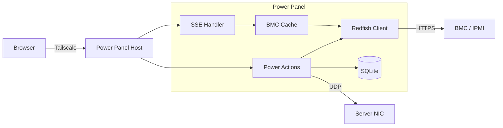

<div align="center">

# Power Panel

**Remote server power management from your phone**

[](https://github.com/camjac251/power-panel/actions/workflows/ci.yml)
[](https://go.dev/)
[](LICENSE)

Single-binary web UI for Redfish/WoL power control, live sensor monitoring, and audit logging. Deploy it anywhere you can reach your BMC.

[Features](#features) · [Quick Start](#quick-start) · [Configuration](#configuration) · [Architecture](#architecture)

</div>

---

## Features

| Feature | Description |
|---|---|
| **Dual-Path Power On** | Redfish first, Wake-on-LAN as automatic fallback |
| **BMC Auto-Detection** | Discovers supported reset types (shutdown, force off, restart) at startup |
| **Live Sensors** | CPU/system temps, fan speeds, power draw streamed via SSE in real time |
| **Tailscale Auth** | Identity from Tailscale Serve headers or WhoIs socket. No login page, no passwords |
| **Audit Log** | Every power action recorded with user, duration, and outcome in SQLite |
| **Transition States** | Instant UI feedback (Powering On, Shutting Down, Restarting) that auto-clears on BMC confirmation |
| **Action Cooldown** | Configurable cooldown prevents accidental rapid-fire commands |
| **Hardened Service** | systemd with DynamicUser, strict sandboxing, empty CapabilityBoundingSet |
| **Zero JS Build Step** | Go + [templ](https://templ.guide) + [htmx](https://htmx.org) + [Tailwind v4](https://tailwindcss.com) |

---

## How It Works



The page loads instantly with no BMC blocking. SSE fills in live power state and sensor data on a configurable poll interval. A shared cache ensures only one BMC call per interval regardless of how many browsers are connected.

---

## Quick Start

### Download

Grab a pre-built binary from [Releases](../../releases) for your platform:

| Binary | Devices |
|--------|---------|
| `power-panel-linux-amd64` | NUCs, mini PCs, x86 servers |
| `power-panel-linux-arm64` | Pi 3/4/5, Rock, Odroid, Pine64 |
| `power-panel-linux-armv7` | Pi Zero 2 W (32-bit), older Pi 3 |
| `power-panel-linux-armv6` | Pi Zero W (original) |
| `power-panel-darwin-arm64` | Apple Silicon Macs |
| `power-panel-darwin-amd64` | Intel Macs |
| `power-panel-windows-amd64.exe` | Windows PCs |

### Prerequisites

- A server with a Redfish-capable BMC (IPMI/iDRAC/iLO/etc.)
- The BMC password in the `IPMI_PASS` environment variable

### Build from source

Requires [mise](https://mise.jdx.dev) for toolchain management (Go, templ, Tailwind CSS, air).

```bash
mise install           # Install Go, templ, tailwindcss, air, golangci-lint
mise run setup         # go mod tidy
mise run build         # Production build (generate + CSS + compile)
mise run build:arm64   # Cross-compile for ARM64
mise run test          # Run tests
mise run lint          # Run golangci-lint
mise run fmt           # Auto-format Go code
```

### Deploy

```bash
mise run deploy        # SCP to target host and restart systemd service
```

Or manually:

```bash
sudo cp power-panel-arm64 /opt/power-panel/power-panel
sudo cp deploy/power-panel.service /etc/systemd/system/
sudo cp deploy/config.example.yaml /etc/power-panel/config.yaml  # edit this
echo "IPMI_PASS=your-password" | sudo tee /etc/power-panel/env
sudo chmod 600 /etc/power-panel/env
sudo systemctl enable --now power-panel
```

The systemd service uses `DynamicUser=yes` and `StateDirectory=power-panel`, so the SQLite database lives at `/var/lib/power-panel/` automatically.

### Tailscale Serve

Power Panel listens on localhost by default. Use [Tailscale Serve](https://tailscale.com/kb/1312/serve) to expose it over your tailnet with HTTPS and identity headers:

```bash
tailscale serve --bg 8080
```

This proxies `https://<hostname>.<tailnet>/` to `localhost:8080`. Tailscale injects `Tailscale-User-Login` and `Tailscale-User-Name` headers, which Power Panel trusts from loopback for audit logging. No login page needed.

### Docker

```bash
docker build -t power-panel .
docker run -d \
  -e IPMI_PASS=your-password \
  -v power-panel-data:/var/lib/power-panel \
  -v /path/to/config.yaml:/etc/power-panel/config.yaml \
  -p 8080:8080 \
  power-panel
```

### Development

```bash
IPMI_PASS=password mise run dev   # Hot-reload with templ + air + tailwindcss watchers
```

Dev server starts at `http://localhost:8080` with live reload via templ's proxy.

---

## Configuration

Copy the example and edit for your environment:

```bash
cp deploy/config.example.yaml /etc/power-panel/config.yaml
```

```yaml
server:
  name: my-server
  description: My Workstation
  # ping_host: "192.0.2.10:22"   # OS reachability check (omit to skip)
  # bmc_url: "https://192.0.2.1" # BMC web UI link (omit to hide)

ipmi:
  host: 192.0.2.1
  username: admin
  insecure: true
  # password from IPMI_PASS env var

wol:
  mac: "00:00:5E:00:53:01"
  broadcast: "192.0.2.255"

power:
  cooldown_seconds: 30
  boot_timeout_seconds: 120
  poll_interval_seconds: 5

data_dir: /var/lib/power-panel
```

| Environment Variable | Description |
|---|---|
| `IPMI_PASS` | **Required.** BMC/IPMI password |
| `DEPLOY_HOST` | Deploy target hostname (default: `power-panel`) |

---

## Architecture

```
main.go              Entry point, flag parsing, signal handling
internal/
  bmc/               Redfish client (gofish), WoL, BMC cache, TCP reachability
  config/            YAML config, env var loading, validation
  db/                SQLite audit log (pure Go, modernc driver)
  server/            HTTP routes, SSE handler, power action handlers
views/               templ templates (home page, layout, helpers)
components/          templUI components (button, dialog, icon, toast, tooltip)
assets/              Embedded static files (fonts, JS, generated CSS)
deploy/              systemd service + example config
```

### Tech Stack

| Layer | Technology |
|---|---|
| Language | [Go 1.26](https://go.dev/) |
| Templates | [templ](https://templ.guide) (type-safe, compiled) |
| Interactivity | [htmx](https://htmx.org) + SSE |
| Styling | [Tailwind CSS v4](https://tailwindcss.com) |
| Components | [templUI](https://www.templui.com) |
| Icons | [Lucide](https://lucide.dev) (SVG, in-memory cache) |
| BMC Protocol | [Redfish](https://www.dmtf.org/standards/redfish) via [gofish](https://github.com/stmcginnis/gofish) |
| Database | [SQLite](https://pkg.go.dev/modernc.org/sqlite) (pure Go, no CGO) |
| Auth | [Tailscale](https://tailscale.com) identity headers |

---

## License

[MIT](LICENSE). [Geist](https://vercel.com/font) font is licensed under the [SIL Open Font License 1.1](assets/fonts/OFL.txt).
